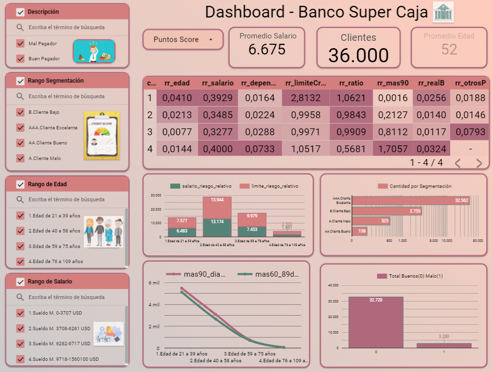

# 🏦 Proyecto 3: Riesgo Relativo :chart:

Este proyecto ha proporcionado habilidades clave para la clasificación de grupos de clientes según su capacidad de pago. Hemos aplicado el concepto de riesgo relativo en la evaluación de la asociación entre diversos factores y la probabilidad de impago, ofreciendo una visión clara de los buenos y malos pagadores.

A lo largo de este proyecto, no solo se ha desarrollado competencias analíticas, sino que también se ha aprendido a aplicar conceptos esenciales como la matriz de confusión. Esta herramienta ha demostrado ser crucial para validar la precisión de las clasificaciones, permitiendo una evaluación detallada de la efectividad de las reglas aplicadas en la clasificación de clientes.

La aplicación de consultas más complejas en BigQuery ha ampliado significativamente el conocimiento y las habilidades en el manejo de datos.

# :desktop\_computer: Herramientas - Lenguajes - Plataformas

La combinación de herramientas de Google, desde BigQuery y Colab para el manejo de datos en SQL y Python, hasta Canva y Google Looker Studio para la creación de presentaciones y dashboards, ha proporcionado una completa y eficiente forma en la entrega del proyec

#### Este proyecto no solo ha optimizado el proceso de análisis de crédito en "Super Caja", sino que también se ha logrado habilidades y conocimientos valiosos para enfrentar desafíos analíticos en diversos campos.to.

# :woman\_technologist: Dashboard

<figure><figcaption></figcaption></figure>
